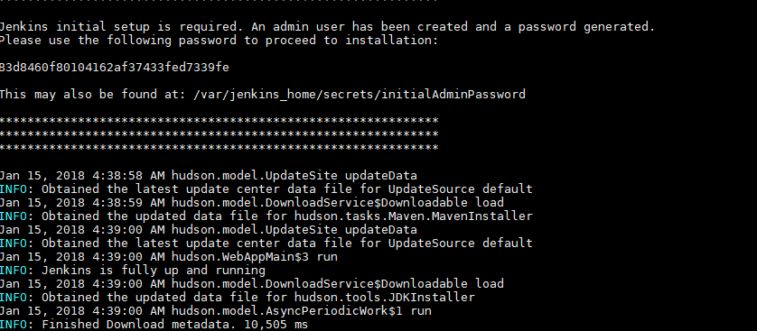
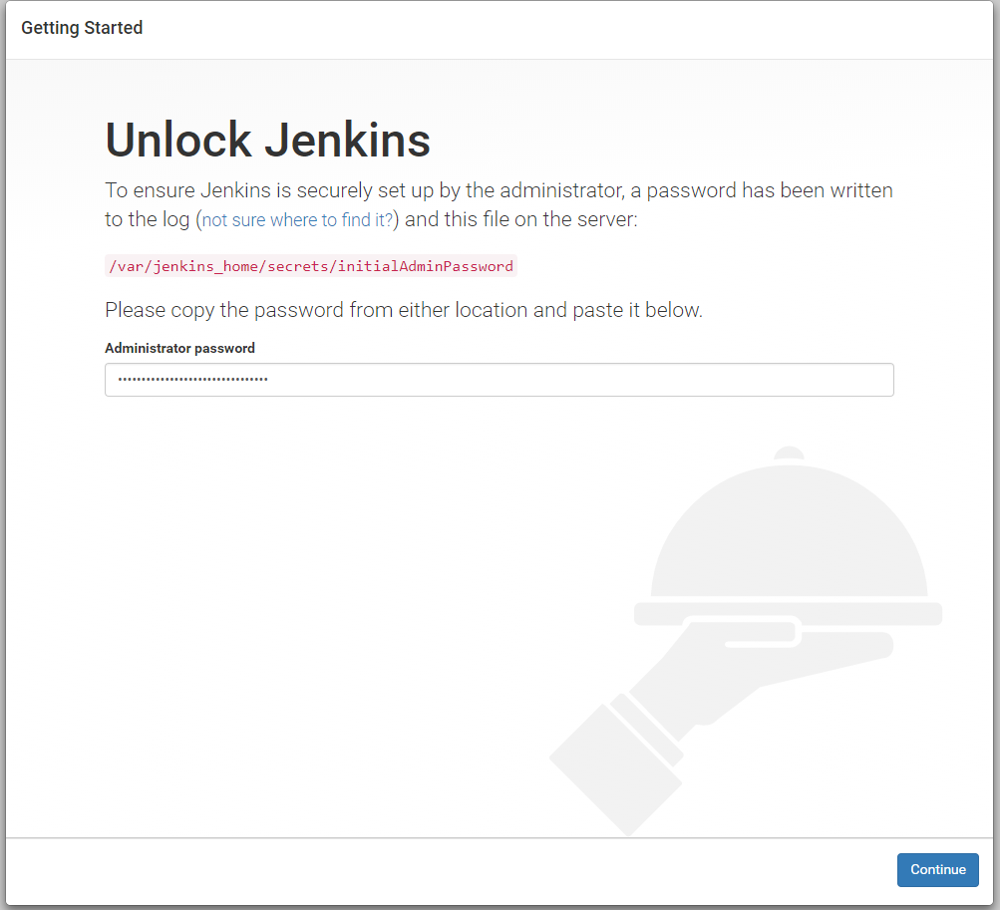

# Docker ci/cd play tools
A custom docker imagen for a development enviroment of [Jenkins](https://jenkins.io/). I used some original files from  [docker](https://github.com/jenkinsci/docker)  [Jenkins](https://jenkins.io/) repository to create it. Yes! Yes! I KNOW IT! this is another jenkins image in docker ... but this one includes little toys that will make your life easier to get into "DevOps' World".

!!! mysterious background music !!!


# What does this image contain?
By default:
* `jenkins version:2.89.1`
* `ansible version:2.4.2.0`
* `maven version:3.3.9`
* `gradle version:2.4.2.0`

# Usage
To build it (Basic build):
```
docker build -t isdaimonos/jenkins-full:latest -f Dockerfile.dockerfile .
```
To run it:
clone the repository and follow this lines
```
cd docker_ci_tools
```
```
docker run --name jenkins-full -d -p 8080:8080 -p 50000:50000 -v `pwd`:/var/jenkins_home isdaimonos/centos/jenkins-full:latest --restart on-failure
```
# Extended usage
Sending extra vars like JVM params
```
docker run --name jenkins-full -d -p 8080:8080 -p 50000:50000 -v `pwd`:/var/jenkins_home --env JAVA_OPTS="-Dhudson.footerURL=http://myhost -Djava.awt.headless=true" isdaimonos/centos/jenkins-full:latest 
```
After it, you will run the following command

```
docker logs -f jenkins-full
```
you should see the following logs



Copy the string and open your browser (I hope you have the IP of the docker host) http://yourip:8080



Paste it! and press continue!!! The next two steps make the selection you want.